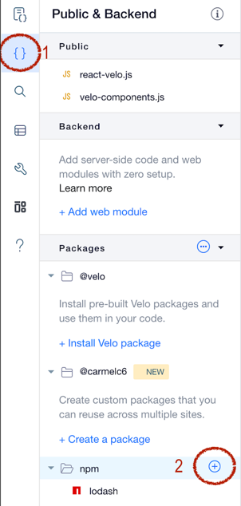
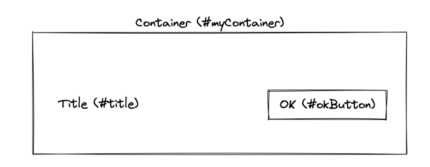
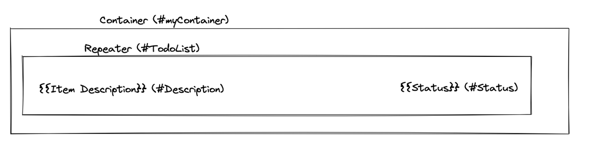

# React Velo
Add the ability to use native React APIs (components and hooks) to Velo, by creating a React structure which corresponds to dynamic elements in the editor.
React Velo supports React native APIs (`ref` supports only ref callback syntax and has a slightly different API), 

## Installation
This module is aimed to be used in Wix Velo environment.
1. Open a Wix Site
2. Enable Dev Mode
3. Add `@wix/react-velo` npm module
4. Add `react` npm module



## Usage Example
Given a site with the following elements (and their Velo IDs),


A Velo User can control these elements the behavior, style and content using the following React Velo code<br>

```javascript
import React, { useState } from 'react';
import { render, W } from '@wix/react-velo';

function App() {
  const [background, setBackground] = useState('green');
  return (
    <W.myContainer style={{backgroundColor: background}}>
      <W.title text={'Click to change background'} />
      <W.okButton onClick={() => setBackground('red')} />
    </W.myContainer>
  );
}

$w.onReady(() => render(App, $w, React));
```

## API
### Module Exports
| Member 	 | Type  	 | Description  	                                                                                                                                                                                                                                                                                                                  |
|----------|---------|---------------------------------------------------------------------------------------------------------------------------------------------------------------------------------------------------------------------------------------------------------------------------------------------------------------------------------|
| 	render  | Method	 | The method which initiates the link between the editor elements and the react component which represents their behavior.<br> It should be invoked in `$w.onReady` method	                                                                                                                                                       |
| 	W       | Object	 | An object representing the Wix Editor/ Editor X elements such that `W.<id>` is a React representation of the Editor element in this page. The returned component's props are identical to the Velo representation of the Element returned by using `$w(<id>)`.<br> For exact props and usages, see [Wix Editor Elements ($w)](https://www.wix.com/velo/reference/$w) API |


#### Render method
`render(Component, $w, React, callback?)`

| Member 	   | Type  	     | Description  	                                                                                                                                |
|------------|-------------|-----------------------------------------------------------------------------------------------------------------------------------------------|
| 	Component | Method	     | The React component root	                                                                                                                     |
| 	$w        | $w	         | The Wix query element provided in a page API	                                                                                                 |
| 	React     | React Instance	 | The React instance used in this page, in order to assure that `react-velo` is using the same React version as the hosting page	               |
| 	callback  | () => void | *(Optional)* A callback to be passed to the react-velo `react-reconsiler` implementation, see [React Reconsiler documentation](https://github.com/facebook/react/tree/main/packages/react-reconciler) for more details |                                                                                                                             |

#### Repeaters
A [Repeater](https://www.wix.com/velo/reference/$w/repeater) is a special Wix Editor Element which is responsible to generate a list of elements from either a data-set (dynamic) or an array set by Velo code).
In order to provide a React component API, React Velo creates a specialized react component which allows controlling the rendering of each item using a `renderItem` prop, as seen in the following example:

Given A following page with a repeater


Its React implementation can be controlled using the following code
```javascript
import React, { useState } from 'react';
import { render, W } from '@wix/react-velo';

function App() {
  const [todos, setTodos] = useState([{
    _id: '1',
    description: 'Item 1',
    status: 'In Progress',
  }, {
    _id: '2',
    description: 'Item 2',
    status: 'Done',
  }]);
  // Actions to control the list can be added
  return <W.TodoList data={todos} renderItem={({ description, status }) => 
    (
      <>
        <W.Description text={description}/>
        <W.Status text={status}/>
      </>
    )
  }/>;
}

$w.onReady(() => render(App, $w, React));
```
##### Repeater Component API

| prop 	      | Type  	            | Description  	                                                              |
|-------------|--------------------|-----------------------------------------------------------------------------|
| 	data       | Array	             | The data to be used by the repeater, similar to `$w('#TodoList').data`	     |
| 	renderItem | (itemData) => void | The representation of each item, similarly to `$w('#TodoList').onItemReady` |


##### Native Elements access

A velo user can access "native" velo components (i.e. the object you get from `$w('#someid')`) using react's `ref` mechanism.
For example, if you want to use some Text's `scrollTo()` method, we can do something like that:
```javascript
let textRef;
const setTextRef = (element) => {
    textRef = element;
};
// ...
<W.MyButton onClick={() => {
    if (textRef) {
        console.log('Scrolling...'); 
        textRef.scrollTo();
    }
}} />
<W.text3 text={`Selected: ${selectedColorName}`} ref={setTextRef} />
```

##### Animation

Animation can be achivied using `wix-animation` as usual, simply by getting the element's native reference and creating a proper animation timeline.

```javascript
import React from 'react'; // import react for JSX transpilation
import { W, render } from '@wix/react-velo'; // import this library
import wixAnimations from 'wix-animations'; // animations library

const timeline = wixAnimations.timeline();
function App() {
  const effect = {scale: 2, duration: 200, "rotate": 360};
  let refSet = false;
  const setRef = (element) => {
    if (!refSet && element) {
      refSet = true;
      timeline.add(element, effect);
    }
  };

  return (
    <W.MyButton
      ref={setRef} 
      onMouseIn={() => timeline.play()}
      onMouseOut={() => timeline.reverse()}
    />
  );
}

$w.onReady(() => render(App, $w, React));
```

Sometimes a velo user would like to compose multiple elements to a single timeline animation,
Here is an example of how it can be achieved: 
```javascript
// A helper function to collect the native element refs
function createAnimation(animationOptionsArray) {
  const timeline = wixAnimations.timeline();
  let refsSetCounter = 0;
  const refsArray = animationOptionsArray.map(() => null);

  const applyAnimationSettings = () => {
    if (refsSetCounter < animationOptionsArray.length) {
      return;
    }

    animationOptionsArray.forEach((animationOptions, idx) => {
      timeline.add(refsArray[idx], animationOptions);
    });
  };
  
  return {
    timeline,
    setRefs: animationOptionsArray.map((_, idx) => (el) => {
      if (!refsArray[idx] && el) {
        refsSetCounter++;
        refsArray[idx] = el;
        applyAnimationSettings();
      }
    })
  };
}
// ...
// Usage:
const animation = createAnimation([
  {scale: 0.8, duration: 200},
  {opacity: 1, duration: 100},
  {opacity: 0, duration: 10},
]);
const onMouseIn = () => animation.timeline.play();
const onMouseOut = () => animation.timeline.reverse();
/// ...
return (
  <W.container1 onClick={onClick}>
    <W.mainColor
      ref={animation.setRefs[0]} 
      style={{backgroundColor: props.color}} 
      onMouseIn={onMouseIn} 
      onMouseOut={onMouseOut}>
    </W.mainColor>
    <W.blackBorder ref={animation.setRefs[1]} />
    <W.emptyBorder ref={animation.setRefs[2]} />
  </W.container1>
);
```
